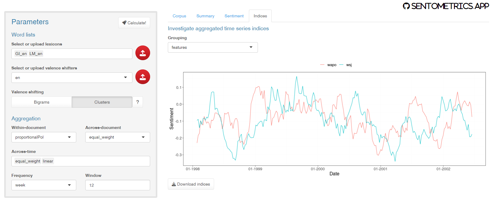

## _sentometrics.app_: A Shiny Interface to the R Package _sentometrics_

<!--- [](https://cran.r-project.org/package=sentometrics.app) --->
<!--- [](http://www.r-pkg.org/pkg/sentometrics.app) --->
<!--- [](http://www.r-pkg.org/pkg/sentometrics.app) --->
<!--- [](https://github.com/SentometricsResearch/sentometrics.app/pulls) --->
<!--- [](https://github.com/SentometricsResearch/sentometrics.app/issues) --->

The **`sentometrics.app`** package offers a Shiny interface for fast document-level textual sentiment computation and aggregation into textual sentiment time series. The obtained values can be downloaded for further use. The functionalities provided are partly those from the [**`sentometrics`**](https://github.com/SentometricsResearch/sentometrics) package.

### Installation

To install the package, do one of:

```R
# install.packages("sentometrics.app") # from CRAN (not yet, but might one day)
devtools::install_github("DataWanderers/sentometrics.app") # development version (may be buggy...)
```

### Usage

To start the application, you just need two lines of code:

```R
library("sentometrics.app")
sentometrics.app::sento_app()
```

This is how it looks (but a bit less pixelated hopefully :-)):

<p align="center">  </p>

Enjoy exploring the filters and outputs!

### References

Use `citation("sentometrics.app")` to cite use in publications.

